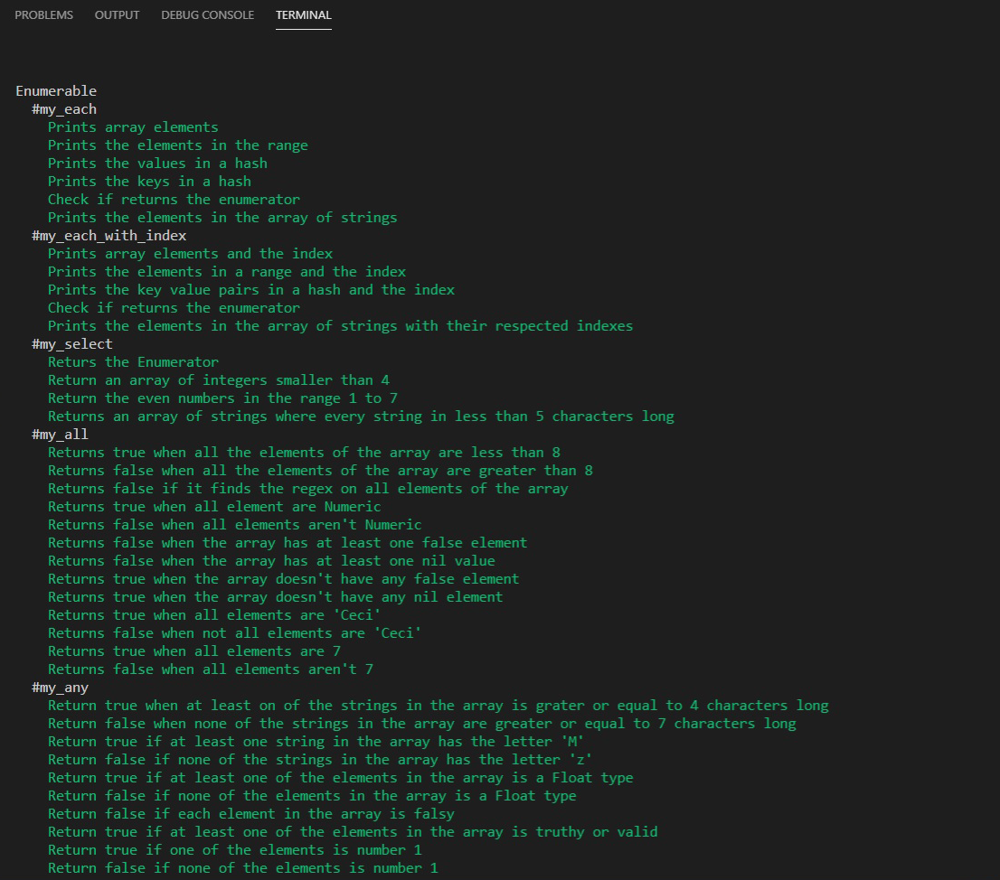

# 🧐 Enumerable Methods

> In this project we replicate the functionality of the following enumerable methods:

- #my_each
- #my_each_with_index
- #my_select
- #my_all?
- #my_any?
- #my_none?
- #my_count
- #my_map
- #my_inject
- #multiply_els

## 🔧 Built With

- Ruby
- Rubocop linter

## 🔴 Live Demo

[Live Demo Link](https://repl.it/join/wtscdvoa-marcoshdezcam1)

## 🛠 Getting Started
## Install 
Besides the live demo link, you can run those functions in you own local environment. In order to run, you need to install Ruby in your computer. For windows you can go to [Ruby installer](https://rubyinstaller.org/) and for MAC and LINUX you can go to [Ruby official site](https://www.ruby-lang.org/en/downloads/) for intructions on how to intall it. Then you can clone the project by typing ```git clone https://github.com/Ceci007/Tic-Tac-Toe.git```

To get a local copy up and running follow these simple example steps.

- Go to the main page of te repo.
- Press the "Code" button and get the repo link.
- Clone it using git.

## Run Enumerables
Type ```bin/main.rb``` in the root file of the project. You can also type ```ruby bin/main.rb``` in the root file of the project.
## Testing
This enumerable methods where tested using [RSpec](https://en.wikipedia.org/wiki/RSpec), which is a Domain-specific Language testing tool written in Ruby, to test Ruby code.
### Install RSpec
- In a terminal window type `gem install rspec`
- The tests are already inside the `.rspec/main_spec.rb` file
### Run tests
- Open ```./spec/main_spec.rb``` file.
- To run the tests just run ```rspec``` in aterminal window.
- If all tests were passed you will see:
  
- We used 'smplecov' gem to generate a report of the lines of Ruby code tested
  

## ✒️ Authors

👤 **Marcos Hernández Campos**

- Github: [@marcoshdezcam](https://github.com/marcoshdezcam)
- Twitter: [@MarcosHCampos](https://twitter.com/MarcosHCampos)
- Linkedin: [Marcos Hernández](https://linkedin.com/marcos-hernández-56058119a/)

👤 **Samuel Isaac Almao Herrera**

- Github: [@SigmaSam](https://github.com/sigmasam)

👤 **Cecilia Benitez Casaccia** 

- Github: [@Ceci007](https://github.com/Ceci007)
- LinkedIn:[LinkedIn](https://www.linkedin.com/in/cecilia-ben%C3%ADtez-casaccia-498669185/)

## 🤝 Contributing

Contributions, issues and feature requests are welcome!

Feel free to check the [issues page](issues/).

## Show your support

Give a ⭐️ if you like this project!

## 📝 License

This project is [MIT](lic.url) licensed.

