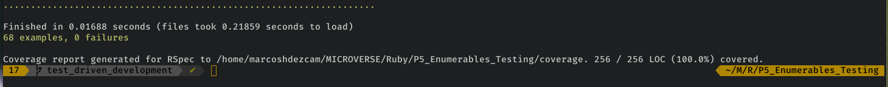
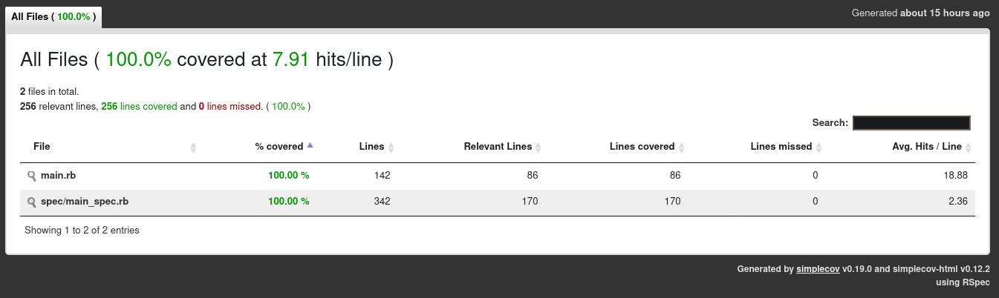

# Enumerable Methods

> In this project we replicate the functionality of the following enumerable methods:

- #my_each
- #my_each_with_index
- #my_select
- #my_all?
- #my_any?
- #my_none?
- #my_count
- #my_map
- #my_inject
- #multiply_els

## Built With

- Ruby

## Live Demo

[Live Demo Link](https://repl.it/join/wtscdvoa-marcoshdezcam1)

## Testing

This enumerable methods where tested using [RSpec](https://en.wikipedia.org/wiki/RSpec), which is a Domain-specific Language testing tool written in Ruby, to test Ruby code.

### Install RSpec

- In a terminal window type `gem install rspec`
- The tests are already inside the `.rspec/main_spec.rb` file

### Run tests

- To run the tests just run `rspec`
- All tests passed
  
- We used 'smplecov' gem to generate a report of the lines of Ruby code tested
  

## Authors

👤 **Marcos Hernández Campos**

- Github: [@marcoshdezcam](https://github.com/marcoshdezcam)
- Twitter: [@MarcosHCampos](https://twitter.com/MarcosHCampos)
- Linkedin: [Marcos Hernández](https://linkedin.com/marcos-hernández-56058119a/)

👤 **Samuel Isaac Almao Herrera**

- Github: [@SigmaSam](https://github.com/sigmasam)

## 🤝 Contributing

Contributions, issues and feature requests are welcome!

Feel free to check the [issues page](issues/).

## Show your support

Give a ⭐️ if you like this project!

## 📝 License

This project is [MIT](lic.url) licensed.

